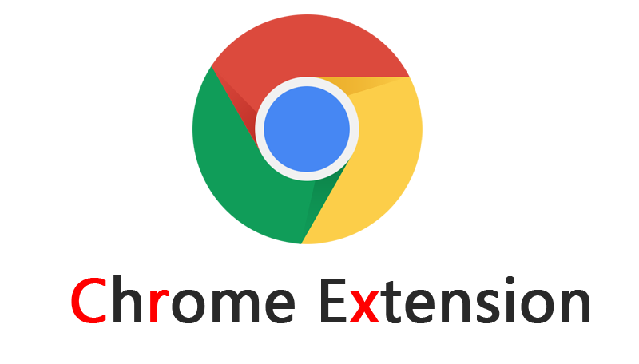

::: tip 特别鸣谢
[chrome-plugin-demo](https://github.com/sxei/chrome-plugin-demo)

总结的很好，给我提供了很多帮助。可惜年久失修，目前已经不太适用，为了延续这位大神的意志，我针对最新版本的 `manifest_version: 3` 做校正，所以才有了这个网站。
:::

# 什么是Chrome插件

严格来讲，我们正在说的东西应该叫Chrome扩展(`Chrome Extension`)，真正意义上的Chrome插件是更底层的浏览器功能扩展，可能需要对浏览器源码有一定掌握才有能力去开发。鉴于Chrome插件的叫法已经习惯，本文也全部采用这种叫法，但读者需深知本文所描述的Chrome插件实际上指的是Chrome扩展。

Chrome插件是一个用Web技术开发、用来增强浏览器功能的软件，它其实就是一个由HTML、CSS、JS、图片等资源组成的一个[.crx](https://developer.chrome.com/extensions/crx)后缀的压缩包.

有人猜测`crx`可能是`Chrome Extension`如下3个字母的简写：

# 学习Chrome插件开发有什么意义

增强浏览器功能，轻松实现属于自己的“定制版”浏览器，等等。

Chrome插件提供了很多实用API供我们使用，包括但不限于：

- 书签控制；
- 下载控制；
- 窗口控制；
- 标签控制；
- 网络请求控制，各类事件监听；
- 自定义原生菜单；
- 完善的通信机制；
- 等等；

# 为什么是Chrome插件而不是Firefox插件

1. Chrome占有率更高，更多人用；
2. 开发更简单；
3. 应用场景更广泛，Firefox插件只能运行在Firefox上，而Chrome除了Chrome浏览器之外，还可以运行在所有webkit内核的国产浏览器，比如360极速浏览器、360安全浏览器、搜狗浏览器、QQ浏览器等等；
4. 除此之外，Firefox浏览器也对Chrome插件的运行提供了一定的支持；